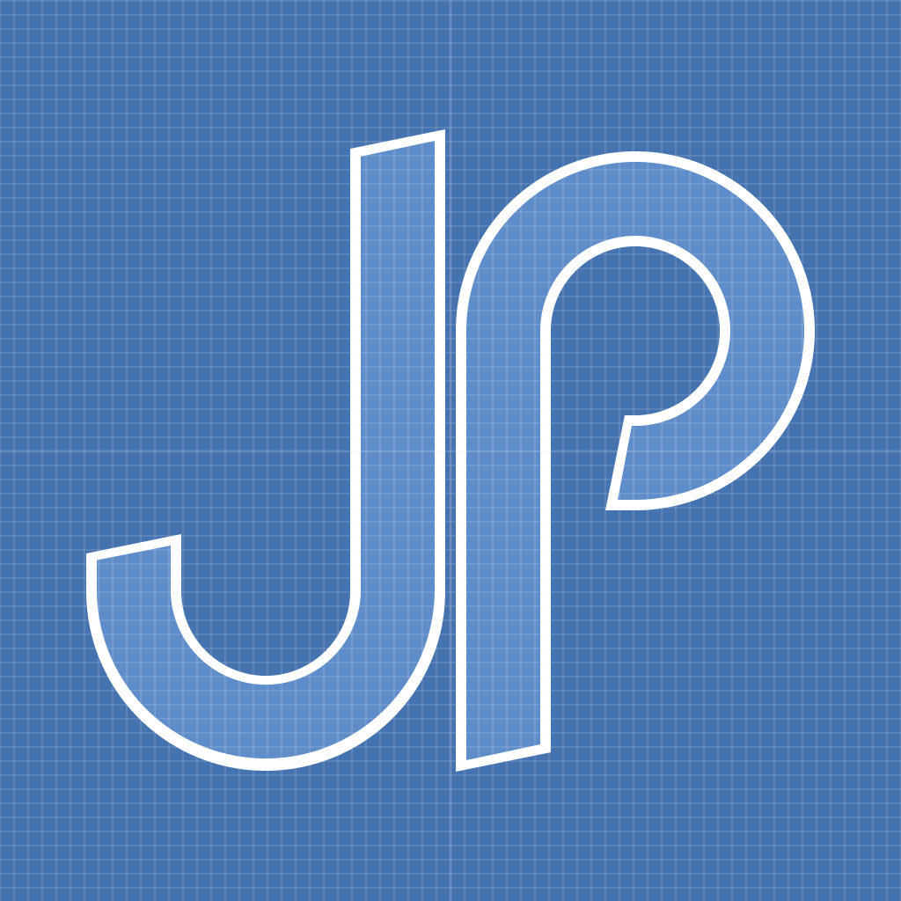
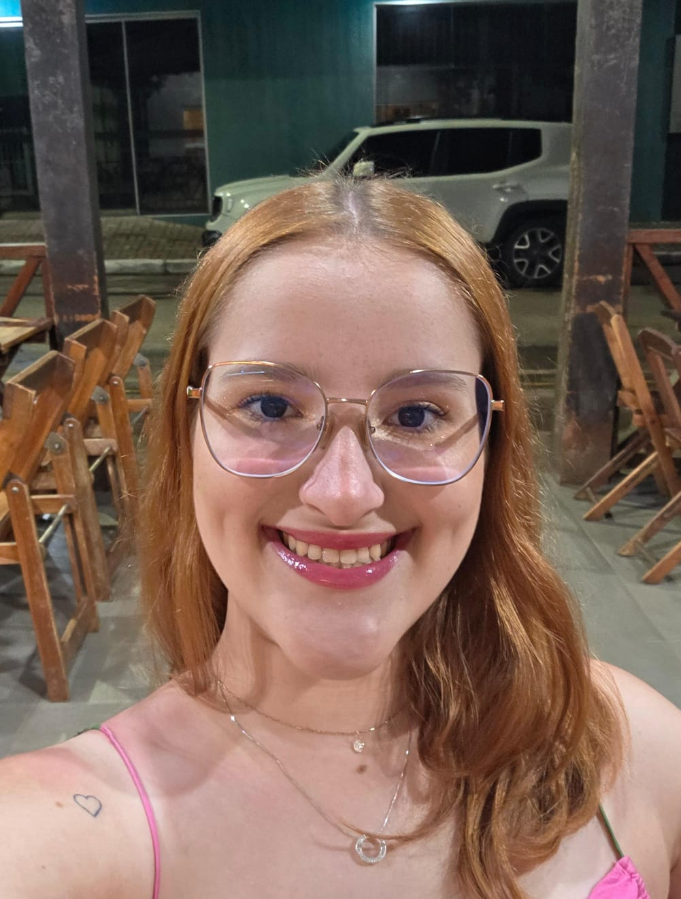

<h1 class="profile-name">João Pedro Delpasso</h1>

<a href="https://github.com/JpdcJpdc" class="button"></i>GitHub</a>
<a href="https://jpdc.itch.io/" class="button">Itch.io</a>
<a href="mailto:joao_delpasso@hotmail.com" class="button">Email</a>

<h1 class="profile-name">Maria Eduarda Motta Rosa</h1>

<a href="https://github.com/Maria-Eduarda-001" class="button">GitHub</a>
<a href="mailto:mariaeduardamottarosa001@aluno.ufsj.edu.br" class="button">Email</a>

<a href="./relatorio/index.html" class="button shared-btn">Acessar Relatórios</a>

Página dedicada a apresentação da dupla, e a divulgação dos relatórios da disciplina de Estatística e Probabilidade. Ainda em construção :)

