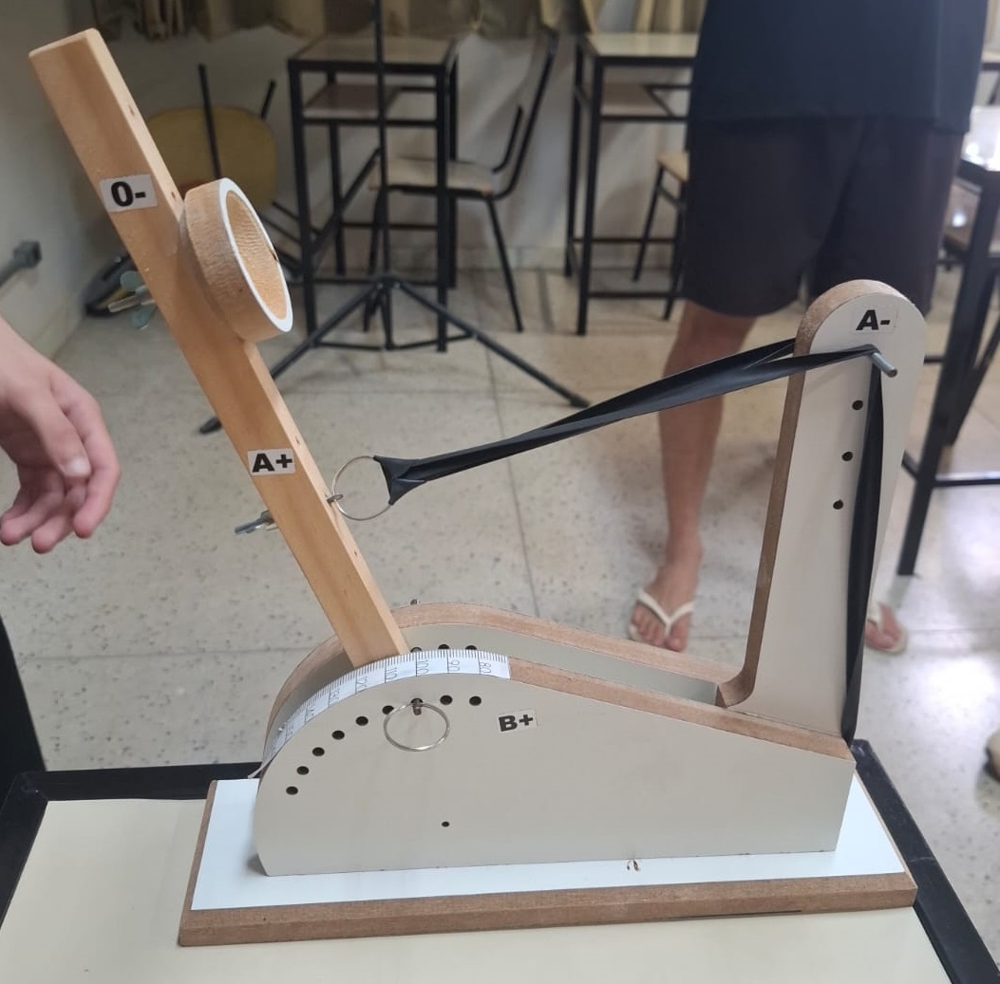
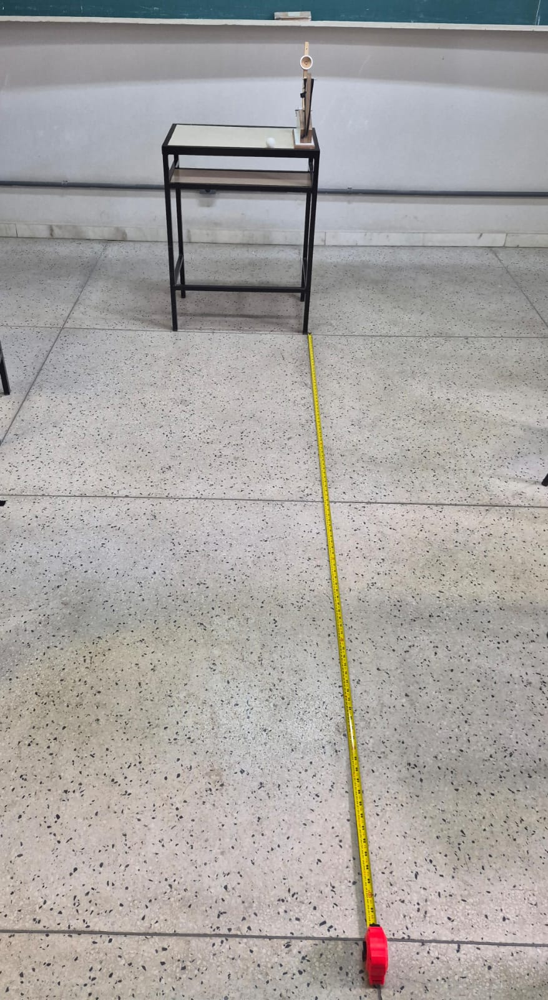
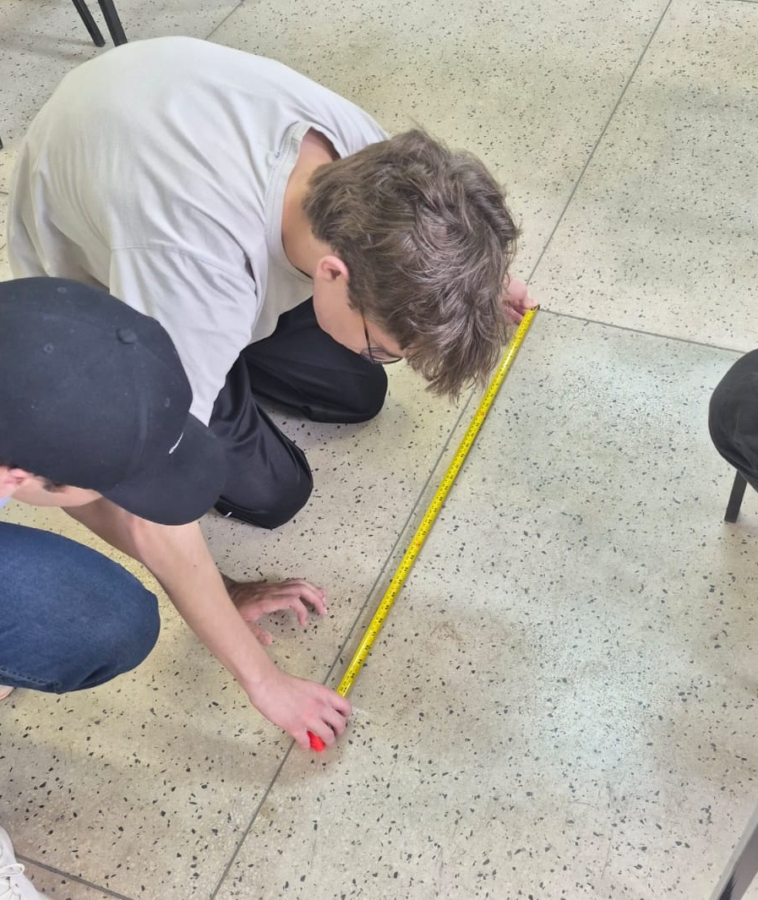

---
# Só mude aqui!!!!
author: "João Delpasso e Maria Eduarda Motta"
title: "Segundo Relatório do Experimento da Catapulta"
bibliography: referencias.bib
# A partir daqui nao faca alteracoes!!!!!
link-citations: true
csl: associacao-brasileira-de-normas-tecnicas-ipea.csl
subtitle: "<a href='https://bendeivide.github.io/courses/epaec/' target='_blank'>Estatística e Probabilidade</a> </br> <a href='https://bendeivide.github.io' target='_blank'>Prof. Ben Dêivide (DEFIM/CAP/UFSJ)</a>"
include-before-body: header.html
date: now
date-format: "DD/MM/YYYY, HH:mm"
lang: pt-BR
format:
  html:
    toc: true
    number-sections: true
    theme: bootstrap
    #css: styles.css
    code-fold: true
    code-tools: true
execute:
  echo: true
  warning: false
  message: false
---


## Introdução

Neste relatório, será realizado mais uma coleta de dados utilizando a catapulta. Os dados serão utilizados para calcular e analisar medidas de dispersão, como a variância e o desvio padrão, com o objetivo de compreender melhor a variabilidade dos dados coletados e como ela se relaciona com as medidas de tendência central, como a média e a mediana. 

A análise dos resultados permitirá avaliar a consistência do experimento, o quanto a distância de aterrissagem da bola de ping pong varia entre os lançamentos com os mesmos parâmetros iniciais.


## Objetivos

### Objetivo geral

Calcular e analisar as medidas de dispersão dos dados coletados a partir dos lançamentos da catapulta, para compreender a variabilidade dos resultados e sua relação com as medidas de tendência central.

### Objetivos específicos

- Compreender os conceitos de variância e desvio padrão e sua aplicação na análise de dados experimentais.
- Realizar a coleta de dados utilizando a catapulta.
- Realizar a tabulação dos dados
- Calcular as medidas de posição e dispersão para os dados exatos e tabulados.
- Analisar a variabilidade dos dados e sua relação com as medidas de tendência central.
- Discutir os resultados e possíveis fontes de variabilidade no experimento.

---

## Fundamentação Teórica

Para a análise dos dados coletados será feito um estudo com base no livro de Estatística & Probabilidade aplicada às Engenharias e Ciências, @EstaProb2024, serão aplicados os conceitos de medidas de dispersão, que são fundamentais para entender a variabilidade dos dados em relação à média. As principais medidas de dispersão que serão abordadas são:

- Variância

  Essa medida indica o grau de dispersão dos dados em relação à média, ou seja o quanto os valores se afastam da média. A variância pode ser calculada com:

  $$S^2 = \frac{1}{n-1}\sum_{i=1}^{n} (x_i - \bar{x})^2$${#eq-variancia}

- Desvio padrão

  Para facilitar a interpretação da variabilidade dos dados, o desvio padrão é utilizado, sendo a raiz quadrada da variância. Ele é expresso na mesma unidade dos dados originais, o que facilita a compreensão da dispersão em relação à média. O desvio padrão é calculado por:

  $$S = \sqrt{S^2}$${#eq-desvio-padrao}

- Coeficiente de variação

  Para comparar a variabilidade entre conjuntos de dados com médias diferentes, o coeficiente de variação é utilizado, sendo a razão entre o desvio padrão e a média, expressa em porcentagem. Ele é calculado por:

  $$CV = \frac{S}{\bar{x}} \times 100\%$${#eq-coeficiente-variacao}

## Metodologia

### Procedimento
O experimento foi realizado por um grupo de seis alunos, onde cada um desempenhou uma função específica para a coleta dos dados, dentre as funções, foram realizadas as tarefas de fixar a catapulta, realizar os lançamentos, aferir e medir a distância de aterrissagem da bola, registrar os dados e tirar fotos do experimento. O procedimento seguiu os seguintes passos:

- Organização do espaço: 

  A sala de aula foi organizada para facilitar os lançamentos, com a remoção de mesas que estavam no percurso da catapulta e a colocação de uma mesa para apoiar a catapulta.

- Configuração da catapulta: 

  A catapulta foi montada e posicionada em uma mesa da sala de aula, com uma altura de 78 cm. As variáveis da catapulta foram organizadas de forma aleatória:
  - A- na primeira posição(de cima para baixo);
  - B+ 100°;
  - A+ na segunda posição;
  - O- na terceira posição(de baixo para cima).

{width=80%}

- Lançamento teste: 

  Foi realizado um primeiro lançamento teste para verificar onde a bola de ping pong aterrissaria, e a partir disso, foi decidido medir com referência da segunda divisão do piso a partir do ponto de lançamento, facilitando a coleta dos dados. A referência está a 2.5 metros do ponto de lançamento, como mostrado na imagem abaixo:

{width=80%}

- Lançamentos e coleta de dados: 

  Foram realizados um total de 40 lançamentos consecutivos, com a mesma configuração da catapulta, e a distância de aterrissagem da bola de ping pong foi medida a partir da referência e registrada para cada lançamento.

  {width=80%}

### Materiais utilizados

Para esse procedimento foram utilizados:

- Uma mesa da sala de aula (de 78 cm);
- Uma catapulta.
- Uma bolinha de pingue-pong.
- Uma trena.
- Um caderno para registro dos dados.

---

## Resultados e Discussão

### Apresentando os resultados com comentários

Os Dados coletados nos 40 lançamentos foram os seguintes (em cm):

```{r,eval = TRUE}
#| code-fold: false
#| code-line-numbers: true
dados <- read.csv("dados.csv")

lancamentos <- dados$dist

lancamentos
```

Como a medição foi feita a partir do ponto de referência, é preciso somar a distância medida com a distância do ponto de referência para obter a distância total percorrida pela bola. Assim, os dados corrigidos e ordenados são:

```{r,eval = TRUE}
#| code-fold: false
#| code-line-numbers: true
lancamentos <- sort(lancamentos) + 250
lancamentos
```

Com os dados corrigidos, pode-se realizar a tabulação utilizando o pacote `leem`:

```{r,eval = TRUE}
#| code-fold: false
#| code-line-numbers: true
library(leem)

lancamentos_leem <- new_leem(lancamentos, variable = "continuous")

lancamentos_tabulados <- tabfreq(lancamentos_leem)
lancamentos_tabulados

```


As medidas de posição para os dados tabulados e exatos são:

- Média: `r round(mean(lancamentos_leem), 2)` cm e `r round(mean(lancamentos), 2)` cm
- Mediana: `r round(median(lancamentos_leem), 2)` cm e `r round(median(lancamentos), 2)` cm

As medidas de dispersão com base nas equações @eq-variancia e @eq-desvio-padrao para os dados tabulados e exatos são:

- Variância: `r round(variance(lancamentos_leem), 2)` cm² e `r round(var(lancamentos), 2)` cm²
- Desvio padrão: `r round(sd(lancamentos_leem), 2)` cm e `r round(sd(lancamentos), 2)` cm

Com o desvio padrão e a média, é possível calcular o coeficiente de variação utilizando a equação @eq-coeficiente-variacao:

- Coeficiente de variação: `r round((sd(lancamentos_leem) / mean(lancamentos_leem)) * 100, 2)` % e `r round((sd(lancamentos) / mean(lancamentos)) * 100, 2)` %

::: {.callout-note}
As medidas foram calculadas utilizando R dentro do Quarto, as funções utilizadas foram: `mean()`, `median()`, `var()`, `sd()` para os dados exatos, e as funções `mean()`, `median()`, `variance()` e `sd()` do pacote `leem` para os dados tabulados.
:::

A variância e desvio padrão são maiores quando calculados a partir dos dados tabulados, isso acontece porque com os valores tabulados ela passa a tratar todos os resultados de cada classe como ponto médio, quando muitos dos dados exatos estão próximos desse centro da classe, a variância tabulada (geralmente) superestima a distância desses valores, com relação à média geral, já que ela mede a dispersão dos dados.

Com o grafico de barras da frequência dos lançamentos, é possível visualizar a distribuição dos dados e as posições da média e da mediana, mostrando a assimetria dos dados:

```{r,eval = TRUE}
#| code-fold: false
#| code-line-numbers: true
barplot(lancamentos_tabulados, main = "Frequência dos lançamentos", xlab = "Distância (cm)", ylab = "Frequência", barcol = "steelblue")
abline(v = mean(lancamentos_leem), col = "red", lwd = 2, lty = 2)
abline(v = median(lancamentos_leem), col = "green", lwd = 2, lty = 2)
legend("topright", legend = c("Média", "Mediana"), col = c("red", "green"), lwd = 2, lty = 2)
```


### Discutindo os resultados

Com base nos calculos, pode-se oberservar que a média e a mediana estão proximas, porem a mediana é `r median(lancamentos_leem) - mean(lancamentos_leem)` cm maior que a média, o que mostra uma pequena assimetria dos dados, isso pode ser explicado por conta de valores menores porem infrequentes, que, por estarem mais distantes, diminuem o valor da média, enquanto a mediana, por ser o valor central, não é tão afetada por esses valores extremos. Essa assimetria é confirmada pelo gráfico de barras, onde é possível observar que a maioria dos dados estão concentrados em torno da média, mas há uma cauda mais longa para a esquerda.

Em relação à variabilidade dos dados, o desvio padrão aparenta ser um valor 'alto' (de `r round(sd(lancamentos_leem), 2)` cm), o que indica que os lançamentos não são perfeitamente consistentes, o que é esperado em um experimento em sala de aula, onde as medições foram feitas manualmente e com base em um consenso da posição de aterrissagem da bola, o que introduz uma variabilidade adicional nos dados.

Utilizando o coeficiente de variação, é possível comparar a variabilidade dos dados em relação à média, e nesse caso, o coeficiente de variação é de `r round((sd(lancamentos_leem) / mean(lancamentos_leem)) * 100, 2)` %, mostrando que, mesmo o desvio padrão aparenta ser um valor 'alto', em relação a média, a variabilidade é relativamente baixa, o que indica que os lançamentos possuem uma consistência em relação à média.

#### Comentando a respeito desses resultados

1) Os resultados estão de acordo com o esperado?
2) Há grande variabilidade? O que isso significa no contexto do experimento?
3) Quais fatores podem ter influenciado os resultados?
4) Existem possíveis fontes de erro experimental?

Respostas

1) Os resultados estão bons visto que a média e a mediana estão próximas, mas a diferença entre os dados tabulados e os exatos mostra a perda de precisão

2) Nesse experimento tivemos uma variabilidade considerável, o desvio padrão (de 18.35 cm) e a média (de 84.55 cm) mostram uma variação considerável, mostrando que a catapulta não é perfeitamente consistente, o que é esperado de um experimento em aula.

3) Acredito que a força elástica pode ter influenciado os resultados por conta do seu desgaste conforme realizávamos o experimento, o posicionamento também pode ter se modificado mesmo que um pouco por sermos nós alunos que segurávamos tudo, e durante o experimento, notamos que a diferença de posicionamento do nó do elástico (antes, em cima ou depois do metal que segura ele) essa diferença de posicionamento, influenciava ativamente na distância que a bolinha percorria se era maior ou menor, isso por conta de como esse posicionamento modifica a forma como o elástico da catapulta se comporta.

4) Acredito que por ter sido feito em sala de aula, pode ter havido erros de medição (por conta de uma imprecisão na leitura da trena ou mesmo de onde exatamente a bolinha caiu); e também, como na responsta acima, a constante elástica ao longo do tempo pode ter sido alterada também.

## Referências